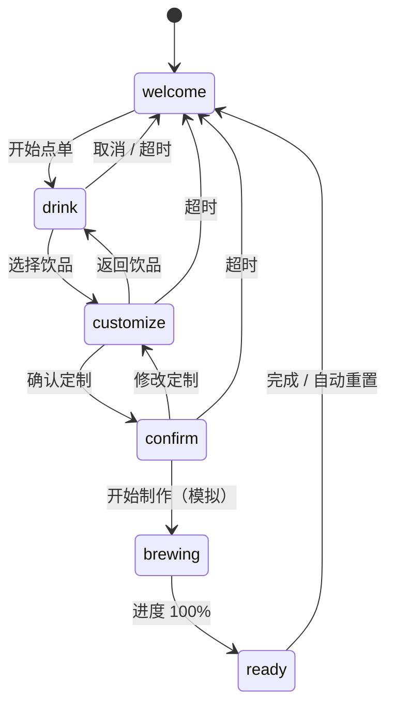

# Kuku Coffee Prototype 开发文档（OOP）

**版本：** 1.1  
**开发阶段：** 核心交互原型（电脑端网页演示）  
**目标呈现：** 9:16 竖向触控售卖机屏幕  
**当前语言：** 简体中文（架构预留繁体中文、英文）  
**核心目标：** 用模块化吉祥物逐步引导用户完成一杯咖啡的选择、基础定制、制作等待与取杯模拟。

> 本文档仅定义开发标准和执行 Prompt；当前阶段不接入真实售卖机硬件、支付、库存、会员、QR 或后端。可选调用本机摄像头，但只做本地权限/视频流验证，不做视觉识别或数据保存。

---

## 1. 已确认的产品范围

### 1.1 使用场景

未来产品将部署在自动咖啡售卖机上，可放置于室内或户外；售卖机右侧有一块醒目的大型 9:16 竖屏。当前只需在电脑浏览器中实现该屏幕的网页原型。

主要顾客为大学生，典型情境包括：课间时间短、下午困倦、希望快速自助购买、不想与店员沟通、又希望得到一点轻松友好的引导。

### 1.2 第一版必须实现

1. 9:16 竖屏的自助售卖机界面，可在电脑上清楚演示。
2. 可替换皮肤的吉祥物，以静态贴图加轻量呼吸/切换动画出现。
3. 吉祥物按步骤引导用户：开始 → 选择饮品 → 基础定制 → 确认 → 制作 → 取杯完成。
4. 三款饮品：美式、拿铁、摩卡。
5. 基础定制：甜度、冷热、奶基；奶盖功能以明确占位模块显示。
6. 模拟订单确认和制作进度；完成后返回第一页/待机页。
7. 长时间无操作时自动回到待机页，保证自助设备场景的稳定性。
8. 简体中文完整可用；代码架构可扩展至繁体中文、英文。
9. 可选调用当前电脑的本机摄像头，用于原型演示的本地摄像头能力验证；用户拒绝授权时，全部点单流程仍正常可用。

### 1.3 明确不做（第一版禁止范围）

- 真实支付、退款、库存、价格 API、售卖机控制器或取杯硬件。
- 人脸识别、身份识别、情绪/人口属性推断、用户画像、账户或云端数据。
- QR 会员、积分、营销活动、复杂推荐或售后流程。
- 真实奶盖图案编辑器；只能使用诚实的功能占位模块。
- 长对话、语音输入、自动音频播放。
- 只为“看起来像 AI”而增加的情绪分析、眼神跟随或技术声明。

### 1.4 已确认的默认吉祥物形象

第一版吉祥物使用用户提供的**奶油色拿铁杯角色**：圆润的米白色咖啡杯、顶部可见拉花、深棕色细手脚、正面大眼与微笑。用户提供的参考图包含 `FRONT / LEFT / BACK` 三视图。

- 初版屏幕默认使用 **FRONT 正面**，作为待机、引导、定制、制作和完成页面的静态基础贴图。
- `LEFT` 与 `BACK` 视图仅作为未来扩展素材；第一版不需要为了使用三视图而制作旋转、跟随或复杂动画。
- 成品界面不得把完整三视图参考图（包含 `FRONT / LEFT / BACK` 文字）直接缩小后作为吉祥物；实现时必须使用裁切后的单独正面贴图。
- 推荐资源命名：`/Users/cj/polyugdut/Generated image 1.png`。
- 这套角色图形是可替换 skin，不可被写死进订单、流程或 Controller 逻辑。

---

## 2. 技术决策

### 2.1 推荐技术栈

| 层级 | 技术 | 决策原因 |
| --- | --- | --- |
| UI | React | 适合分步骤界面、可复用组件和状态更新 |
| 语言 | TypeScript | 保证订单、定制、流程和皮肤配置的数据类型明确 |
| 构建环境 | 保留现有 `prototype/` 的 Next/Vinext 结构 | 不替换现有工程，降低风险 |
| 样式 | 原生 CSS / CSS Modules 风格的类名 | 轻量、离线、无需新增 UI 框架 |
| 领域逻辑 | TypeScript OOP 类 | 让订单、会话、状态机、皮肤配置有稳定边界 |
| 本机摄像头 | 浏览器 `navigator.mediaDevices.getUserMedia()` | 原型中仅调用当前电脑摄像头；不需要服务器或第三方视觉服务 |
| 持久化 | 无 | 第一版只做本地内存状态，刷新即重置 |
| 图片资源 | `public/` 本地静态资源 | 符合未来设备离线、稳定、快速加载的需求 |

### 2.2 为什么采用“React UI + OOP 领域层”

React 组件适合负责屏幕渲染和点击事件；而订单、流程、吉祥物皮肤、自动重置等业务规则不应散落在 JSX 中。因此采用以下分工：

```text
React Component（视图、触控事件）
        ↓ 调用
Controller / Session（流程协调）
        ↓ 使用
Domain Models（Order、Drink、Customization、MascotSkin）
        ↓ 输出
View State（当前页面、当前文案、订单摘要、进度）
```

这符合面向对象设计：每个对象负责自己的数据和行为；新增饮品、换皮肤或增加姿态贴图时，不必重写整条购买流程。

### 2.3 面向未来设备的非功能标准

- **稳定：** 不依赖网络；任一步骤可返回；异常或长时间无操作可回到安全的待机状态。
- **效率：** 本地资源、小型状态机、无重型动画、无不必要的轮询和请求。
- **耐用：** 大按钮、清晰状态、无悬浮才可使用的关键功能；浏览器刷新后可从初始页恢复。
- **可维护：** 文案、饮品、皮肤、姿态、流程时间集中配置，不在多个页面重复硬编码。
- **可访问：** 电脑鼠标、键盘和触屏均可完成核心流程；不能只依赖动画或颜色传达状态。
- **摄像头降级：** 摄像头权限被拒绝、设备不存在、被占用或初始化失败时，只显示非阻断性提示并回退到普通“开始点单”路径。

---

## 3. 信息架构与用户流程

### 3.1 页面/步骤

| 步骤 | 页面状态 | 吉祥物职责 | 用户主要动作 | 下一步 |
| --- | --- | --- | --- | --- |
| 1 | `welcome` 待机欢迎 | 欢迎并说明可自助购买 | 点击“开始点单” | `drink` |
| 2 | `drink` 选择饮品 | 帮助理解三款饮品差异 | 选择美式/拿铁/摩卡 | `customize` |
| 3 | `customize` 基础定制 | 提醒按自己喜好选择 | 选甜度、冷热、奶基；查看奶盖占位 | `confirm` |
| 4 | `confirm` 确认订单 | 简洁复述“你选择了什么” | 点击“开始制作” | `brewing` |
| 5 | `brewing` 制作中 | 稳定陪伴，说明进度 | 等待进度完成 | `ready` |
| 6 | `ready` 取杯完成 | 祝福并引导取杯 | 点击“完成”或超时 | `welcome` |

### 3.2 页面流程图



### 3.3 交互规则

1. 每个非待机页面必须有明确的“返回”或“取消”路径，制作中除外。
2. 用户点击任何交互元素，都应刷新无操作计时器。
3. 非制作状态建议 45 秒无操作返回 `welcome`；完成页建议 12 秒后返回 `welcome`。
4. 制作进度只模拟，不出现“付款成功”“真实出杯”等会误导用户的表述。
5. 初版不需要跳过流程；饮品、基础定制和确认步骤是核心体验。
6. 订单完成后重置订单与定制，避免下一位用户看到上一位用户的选择。
7. 本机摄像头仅允许在 welcome 待机/演示状态按用户操作开启；用户开始点单后应停止视频轨道，避免不必要的资源与隐私占用。
8. 初版摄像头模块只验证本地调用、权限和安全释放，不实现也不声称“识别到人”“识别到脸”或“判断购买意图”。

---

## 4. OOP 架构规范

### 4.1 建议目录结构

```text
prototype/
├── app/
│   ├── page.tsx                         # 页面组合与 React 状态桥接
│   ├── globals.css                      # 9:16 屏幕与组件样式
│   ├── layout.tsx                       # 标题、语言、基础 metadata
│   ├── components/
│   │   ├── Mascot.tsx                   # 吉祥物展示组件（可换皮肤/姿态）
│   │   ├── KioskHeader.tsx              # 品牌、步骤指示、语言占位
│   │   ├── StepProgress.tsx             # 流程进度条
│   │   ├── DrinkPicker.tsx              # 饮品选择
│   │   ├── CustomizationPanel.tsx       # 甜度、冷热、奶基、奶盖占位
│   │   ├── OrderSummary.tsx             # 订单摘要
│   │   └── BrewingProgress.tsx          # 模拟制作进度
│   ├── domain/
│   │   ├── Drink.ts                     # 饮品模型
│   │   ├── Customization.ts             # 定制模型
│   │   ├── CoffeeOrder.ts               # 订单模型
│   │   ├── KioskSession.ts              # 购买流程状态机
│   │   ├── MascotSkin.ts                # 皮肤与姿态模型
│   │   └── KioskController.ts           # 领域操作协调器
│   └── content/
│       ├── drinks.ts                    # 三款饮品的静态数据
│       ├── mascotSkins.ts               # 初版皮肤配置
│       └── copy.ts                      # 简体中文文案与未来语言键
├── public/
│   └── mascot/                          # 吉祥物贴图目录
│       └── default/
│           └── idle.png
├── tests/
│   ├── domain.test.mjs                  # OOP 领域逻辑测试
│   └── rendered-html.test.mjs           # 页面关键内容测试
└── README.md                            # 运行、皮肤替换和演示说明
```

可以因现有项目结构微调目录，但必须保留“UI 层、领域层、内容配置层”这三个职责边界。

### 4.2 核心枚举与值对象

```ts
export type KioskStep =
  | "welcome"
  | "drink"
  | "customize"
  | "confirm"
  | "brewing"
  | "ready";

export type Sweetness = "0%" | "30%" | "50%";
export type Temperature = "hot" | "iced";
export type MilkBase = "fresh" | "oat";
export type MascotPose = "idle" | "guide" | "thinking" | "brewing" | "celebrate";
export type Locale = "zh-CN" | "zh-TW" | "en";
```

值对象只能描述一个明确概念，不能让字符串散落在 React 组件中。

### 4.3 `Drink`：饮品领域模型

**责任：** 描述一种可售饮品，而不是处理页面跳转。

```ts
class Drink {
  readonly id: string;
  readonly name: string;
  readonly subtitle: string;
  readonly basePrice: number;
  readonly description: string;
  readonly accentColor: string;

  constructor(input: DrinkInput) { /* 校验并赋值 */ }
  formattedPrice(): string { /* 返回 ¥xx */ }
}
```

规则：饮品数据由 `content/drinks.ts` 提供。第一版必须有美式、拿铁、摩卡；不需要库存字段，也不需要真实价格变更规则。

### 4.4 `Customization`：定制值对象

**责任：** 记录一杯咖啡的基础选择，并提供面向用户的摘要。

```ts
class Customization {
  readonly sweetness: Sweetness;
  readonly temperature: Temperature;
  readonly milkBase: MilkBase;
  readonly foamArtPlaceholder: boolean;

  withSweetness(value: Sweetness): Customization;
  withTemperature(value: Temperature): Customization;
  withMilkBase(value: MilkBase): Customization;
  summaryLabels(locale: Locale): string[];
}
```

必须保持不可变（immutable）：每次修改返回一个新的 `Customization`，不能在 UI 中直接修改对象内部字段。奶盖模块当前固定显示为“即将开放/已预留功能”，不得假装用户真的绘制了图案。

### 4.5 `CoffeeOrder`：订单聚合对象

**责任：** 将一个有效饮品和一组定制选择组合成订单摘要。

```ts
class CoffeeOrder {
  readonly drink: Drink | null;
  readonly customization: Customization;

  selectDrink(drink: Drink): CoffeeOrder;
  updateCustomization(next: Customization): CoffeeOrder;
  isReadyToConfirm(): boolean;
  summary(locale: Locale): OrderSummary;
  reset(): CoffeeOrder;
}
```

规则：`isReadyToConfirm()` 为 `false` 时，确认/制作按钮必须不可用。第一版价格只显示饮品基础价格，基础定制不加价。

### 4.6 `MascotSkin` 和 `MascotSkinRegistry`：吉祥物可替换皮肤

**责任：** 将视觉资产和角色文案从购买流程中解耦。

```ts
type MascotPoseAsset = {
  src: string;
  alt: string;
};

class MascotSkin {
  readonly id: string;
  readonly displayName: string;
  readonly theme: { primary: string; surface: string; accent: string };
  readonly poses: Partial<Record<MascotPose, MascotPoseAsset>>;

  assetFor(pose: MascotPose): MascotPoseAsset;
}

class MascotSkinRegistry {
  private readonly skins: Map<string, MascotSkin>;

  get(id: string): MascotSkin;
  defaultSkin(): MascotSkin;
}
```

初版使用一个 ID 为 `kuku-latte-cup` 的 skin 和一张 `idle.png` 静态贴图。`idle.png` 来自用户提供三视图中的正面奶油色拿铁杯角色。`assetFor()` 应在某个姿态图片不存在时回退到 `idle`，确保未来逐步添加 `guide.png`、`thinking.png`、`brewing.png`、`celebrate.png` 时无需改动流程代码。

### 4.7 `KioskSession`：有限状态机

**责任：** 只处理流程是否合法，避免 UI 随意跳步骤。

```ts
class KioskSession {
  readonly step: KioskStep;
  readonly order: CoffeeOrder;
  readonly brewProgress: number;

  start(): KioskSession;
  chooseDrink(drink: Drink): KioskSession;
  customize(next: Customization): KioskSession;
  continueToConfirmation(): KioskSession;
  beginBrewing(): KioskSession;
  updateBrewProgress(progress: number): KioskSession;
  complete(): KioskSession;
  goBack(): KioskSession;
  reset(): KioskSession;
}
```

状态转移规则：

| 当前状态 | 允许动作 | 目标状态 |
| --- | --- | --- |
| `welcome` | `start()` | `drink` |
| `drink` | `chooseDrink()` | `customize` |
| `customize` | `continueToConfirmation()` | `confirm` |
| `confirm` | `beginBrewing()` | `brewing` |
| `brewing` | `updateBrewProgress(100)` | `ready` |
| `ready` | `reset()` | `welcome` |

无效状态转换必须保留当前 session 或抛出开发期可见的错误；不能为了方便而允许任意字符串切换页面。

### 4.8 `KioskController`：UI 与领域层之间的协调器

**责任：** 让 React 页面只调用语义化动作，例如 `controller.selectDrink("latte")`，而不是直接拼接多个状态变更。

```ts
class KioskController {
  private session: KioskSession;
  private readonly drinks: readonly Drink[];

  snapshot(): KioskSession;
  startOrder(): KioskSession;
  selectDrink(id: string): KioskSession;
  selectSweetness(value: Sweetness): KioskSession;
  selectTemperature(value: Temperature): KioskSession;
  selectMilkBase(value: MilkBase): KioskSession;
  confirmCustomization(): KioskSession;
  startBrewing(): KioskSession;
  setBrewProgress(progress: number): KioskSession;
  reset(): KioskSession;
}
```

React 中可以保存 controller 的初始实例，并将 `snapshot()` 映射到 React 渲染状态；不得把业务逻辑复制到点击回调中。

### 4.9 `LocalCameraService`：本机摄像头适配器

**责任：** 封装浏览器摄像头权限、流生命周期与失败降级；它不参与订单决策，也不保存任何影像。

```ts
export type CameraStatus =
  | "idle"
  | "requesting"
  | "active"
  | "denied"
  | "unavailable"
  | "error";

export interface LocalCameraService {
  status(): CameraStatus;
  start(): Promise<MediaStream>;
  stop(): void;
}

export class BrowserLocalCameraService implements LocalCameraService {
  // 仅使用 navigator.mediaDevices.getUserMedia({ video: true, audio: false })
  // stop() 中停止所有 MediaStreamTrack
}
```

实现规则：

1. 摄像头访问必须来自用户点击“启用本机摄像头”后的 `getUserMedia()`；不能在页面加载时静默请求权限。
2. 使用 `audio: false`；不得录音。
3. 若显示开发演示预览，`<video>` 必须使用 `muted`、`playsInline`，且仅使用当前 `MediaStream`；不可截图、录制、下载或上传。
4. 摄像头状态由服务对象返回；React 只渲染状态和绑定 video element。
5. `stop()` 必须停止所有轨道并清除 video 的 `srcObject`。进入 drink、customize、confirm、brewing、ready 或组件卸载时均应调用。
6. 本地开发通常应通过 `localhost` 或 HTTPS 运行；无法调用时须提供明确但不打断购买的提示。
7. 若未来确实需要“在场/注意力”逻辑，应另行定义、同意并测试一个非身份化的本地检测适配器；不得把这项未来设想冒充为当前功能。

---

## 5. UI 与吉祥物标准

### 5.1 9:16 电脑演示方式

- 桌面浏览器中间显示一个独立的 9:16 “机器屏幕”容器，方便课堂展示。
- 屏幕容器建议最大宽度 540 CSS px，在较大显示器上按照 9:16 比例缩放；在小窗口上允许铺满可用高度/宽度。
- 不需要模拟整台售卖机物理外壳；重点是右侧大屏内部的触控 UI。
- 页面任何步骤均不能出现关键内容被裁切、横向滚动或仅 hover 可见的控件。

### 5.2 吉祥物组件接口

```tsx
type MascotProps = {
  skin: MascotSkin;
  pose: MascotPose;
  message: string;
  reducedMotion?: boolean;
};

export function Mascot({ skin, pose, message, reducedMotion }: MascotProps) {
  // 使用 skin.assetFor(pose)，缺失姿态自动回退 idle
  // 只提供轻量呼吸/淡入/姿态切换动画
}
```

必须做到：

- 将贴图路径、颜色、名称和姿态映射保存在 `MascotSkin` 配置中。
- `Mascot` 不知道当前饮品、订单价格或具体页面流程；它只负责展示皮肤、姿态与传入的引导话术。
- 默认 skin 使用用户指定的奶油色拿铁杯角色。实现前将用户提供的三视图参考图保存在 `public/mascot/kuku-latte-cup/reference.png`，并裁切正面角色保存为 `public/mascot/kuku-latte-cup/idle.png`；不得把带有 FRONT / LEFT / BACK 标签的整张参考图直接当作前台吉祥物。
- 不要删除现有 `public/bean-buddy.png`；它不再是默认 skin，但保留为旧资产或后续可选 skin。
- 动画仅为轻量的 opacity/translate/scale 呼吸效果；支持 `prefers-reduced-motion`。
- 未来添加多张姿态贴图时，优先在 `mascotSkins.ts` 添加映射，不应改 `KioskSession`。

### 5.3 每步吉祥物文案与姿态

| 步骤 | 推荐姿态 | 简体中文文案 |
| --- | --- | --- |
| 欢迎 | `idle` | “嗨，想喝杯咖啡吗？我来帮你快速选好。” |
| 选饮品 | `guide` | “先选一杯你现在最想喝的。” |
| 定制 | `thinking` | “按你的习惯调一调，这一杯更像你。” |
| 确认 | `guide` | “确认一下，我就开始为你准备。” |
| 制作 | `brewing` | “正在制作，请稍等一会儿。” |
| 完成 | `celebrate` | “完成啦，请从取杯口拿走你的咖啡。” |

第一版如果只有一张静态贴图，仍应在代码中传入不同 `pose`；组件会自动回退贴图，但通过文案和轻量 CSS 切换保持引导节奏。

### 5.4 本机摄像头演示标准

- 摄像头是 welcome 页的可选演示能力，不是吉祥物、点单或任何定制步骤的必需输入。
- 唯一可接受的入口是用户主动点击的“启用本机摄像头（演示）”；建议采用次级按钮样式，不能抢占“开始点单”。
- 启用后可显示小型、本地、无录制的视频预览，也可以仅显示“摄像头已就绪”的状态；两种形式都不能声称已经识别到用户。
- 必须提供“关闭摄像头”操作。进入购买流程、完成、超时或离开页面时，也必须自动关闭。
- 若浏览器拒绝权限，应显示“未启用摄像头，你仍可直接点单。”，不得显示错误弹窗或阻止操作。
- 摄像头画面不用于收集、保存、上传、拍照、录像、推断身份或训练模型。

---

## 6. 每个构建部分的 Codex Agent Prompt

以下 prompts 可独立交给 Codex agent 逐段执行。每个 Prompt 都要求 agent 先阅读本文档，且不得扩展第一版范围。

### Part 0：基线检查与实施计划

```text
你正在为 Kuku Coffee 核心交互原型做开发准备。先完整阅读 `Kuku_Coffee_Prototype_OOP_开发文档.md`，并遵守其范围限制。

当前工作只做检查和计划，不编辑任何源代码、不安装依赖、不删除文件。

请检查：
1. `prototype/` 下的 package.json、app/page.tsx、app/globals.css、app/layout.tsx、README、测试文件和 public 资源；
2. 是否存在用户未提交或与本任务无关的改动；
3. 当前原型中哪些旧功能（例如 gaze/目光跟随、服务二维码、隐私检测宣称）不属于本次核心原型；以及如何将已有的本机摄像头调用需求与这些旧概念区分开；
4. 是否已有可复用的吉祥物图片资源。

输出一份简短实施计划，必须包含：计划修改的文件、计划新增的 OOP 领域类、需要保留的资产、测试更新策略，以及任何阻塞项。不要写代码；不要自行增加支付、会员、库存、硬件、云端网络功能，或超出本文第 4.9 节的摄像头能力。
```

### Part 1：建立 OOP 领域模型与静态内容

```text
请阅读 `Kuku_Coffee_Prototype_OOP_开发文档.md`，然后只实现其中第 4 节定义的领域层和内容配置层。不要修改页面视觉 UI，除非为了让 TypeScript 引入通过编译所必需。

目标目录为 `prototype/app/domain/` 和 `prototype/app/content/`。实现以下对象：
- `Drink`
- 不可变的 `Customization`
- `CoffeeOrder`
- `MascotSkin` 与 `MascotSkinRegistry`
- `KioskSession` 有限状态机
- `KioskController`

要求：
1. 所有逻辑使用 TypeScript 严格类型；不得使用 `any` 或未约束的字符串作为步骤/定制值。
2. 创建三款静态饮品数据：美式、拿铁、摩卡；只含本地演示所需信息。
3. 创建 ID 为 `kuku-latte-cup` 的默认吉祥物 skin，使用用户指定的奶油色拿铁杯角色；姿态资源缺失时必须回退到裁切后的 `idle` 正面贴图。
4. `KioskSession` 必须阻止非法步骤跳转；只有选中饮品后才能进入确认页。
5. 基础定制不加价；奶盖只保留 `foamArtPlaceholder` 标志。
6. 不引入数据库、API、支付、库存或浏览器持久化。
7. 为领域对象新增或更新针对性的测试，覆盖正常流程、订单未选饮品时不能确认、姿态回退、reset 清空订单、制作进度到 100 后进入 ready。

完成后运行项目现有可用的 TypeScript/测试命令，报告修改文件、测试结果和尚未实现的 UI 部分。不要重构不相关文件。
```

### Part 2：实现模块化吉祥物组件

```text
请阅读 `Kuku_Coffee_Prototype_OOP_开发文档.md`，并假设第 4 节领域模型已经存在。现在只实现吉祥物视觉模块，不要构建完整点单页面。

在 `prototype/app/components/Mascot.tsx`（或等价的清晰组件路径）实现可替换皮肤的 `Mascot` React 组件，并接收：`skin`、`pose`、`message`、`reducedMotion`。

要求：
1. 组件必须通过 `skin.assetFor(pose)` 获得贴图，缺少多姿态资源时显示 idle，不在组件中硬编码资源路径。
2. 初版使用用户指定的奶油色拿铁杯角色。先将三视图参考图安全保存在 `public/mascot/kuku-latte-cup/reference.png`，再裁切 FRONT 正面为 `public/mascot/kuku-latte-cup/idle.png`；不得直接把含 FRONT / LEFT / BACK 标签的整张参考图放进界面。若需要整理目录，只能复制或新增引用，不能删除现有用户资源。
3. 实现克制的呼吸和姿态切换动画（opacity/transform）；`prefers-reduced-motion: reduce` 或 `reducedMotion` 时停用非必要动画。
4. 吉祥物只显示皮肤、姿态和传入的话术；不得读取订单、饮品或直接控制步骤。
5. 图片应有语义正确的 alt 文本；文字必须在图片之外可读。
6. 不使用 gaze 跟随、人脸/情绪识别或自动播放音频。摄像头能力如已实现，只能经由独立的 `LocalCameraService` 调用，Mascot 组件本身不得直接访问摄像头。

为组件添加最小可验证用法或测试。完成后报告：如何在 `mascotSkins.ts` 添加一张新的 skin，以及如何在未来添加 `guide.png` 等姿态贴图。不要改动购买流程。
```

### Part 2A：实现本机摄像头适配器（不做视觉识别）

```text
请阅读 `Kuku_Coffee_Prototype_OOP_开发文档.md`，特别是第 4.9 节。现在只实现本机摄像头适配器与最小演示控制；不要实现脸部识别、人体识别、注意力识别、截图、录制、上传或任何购买推荐逻辑。

目标：在电脑浏览器的 welcome 演示状态下，用户可以主动点击“启用本机摄像头”，让网页通过浏览器标准 API 调用当前电脑的摄像头；这只是本地能力验证，不是订单流程的必需条件。

要求：
1. 在领域/服务层实现 `LocalCameraService` 与 `BrowserLocalCameraService`，并使用 `navigator.mediaDevices.getUserMedia({ video: true, audio: false })`。
2. 初始化只能由用户点击触发，绝不能在页面加载时静默弹出摄像头权限请求。
3. 在 welcome 页提供一个不抢占主按钮的“启用本机摄像头（演示）”控件，以及 idle/requesting/active/denied/unavailable/error 的清楚中文状态反馈。
4. 如果展示视频预览，必须只在当前页面本地显示，使用 muted 和 playsInline；不得在画面上标记脸、性别、情绪、身份或购买意图。
5. 用户进入 drink 步骤、点击关闭、自动重置、组件卸载或发生错误时，必须停止所有 MediaStream tracks 并清除 video.srcObject。
6. 拒绝权限、无摄像头、浏览器不支持或被其他应用占用时，用户仍能点击“开始点单”并完成全部流程。
7. 不发送任何网络请求，不保存 Blob/图片/视频，不添加第三方摄像头或视觉识别依赖。
8. 添加可测试的服务逻辑或明确的手工验证步骤，覆盖成功开启、拒绝权限和 stop 清理轨道。

完成后报告：受浏览器安全限制影响的运行条件（localhost/HTTPS）、修改文件、验证结果，以及当前摄像头模块明确没有做什么。不要改动饮品、定制或制作功能。
```

### Part 3：构建 9:16 售卖机屏幕框架与待机页

```text
请阅读 `Kuku_Coffee_Prototype_OOP_开发文档.md`，并在不引入任何外部 UI 库的前提下，构建电脑端演示所需的 9:16 售卖机触屏框架和 welcome 待机页。

要求：
1. 在桌面浏览器中央呈现一个比例为 9:16 的屏幕容器；在较小窗口下不横向溢出，保持主要按钮可见。
2. 页面视觉应像售卖机右侧大屏的内部 UI，而不是通用网页或后台仪表盘。
3. welcome 页必须有 Kuku 品牌、模块化 Mascot、简短中文欢迎语和一个很大的“开始点单”按钮。
4. 准备一个紧凑的步骤指示组件，后续可显示“饮品 / 定制 / 确认 / 制作”。welcome 页不必展示复杂进度。
5. 预留一个“简体中文”语言位置；暂时不做繁中/英文翻译或实际语言切换。
6. 触控按钮最小 44 × 44 CSS px，键盘 focus 明显；支持 `prefers-reduced-motion`。
7. 不含支付、库存、QR、会员、营销弹窗或售后功能。若 Part 2A 已完成，可在 welcome 页保留一个低优先级、用户主动触发的“启用本机摄像头（演示）”控件；它不是开始点单的前置条件。

只实现框架和 welcome 页，点击“开始点单”可以暂时以明确的占位回调或最小状态切换进入空白的 drink 区域。不要提前完整实现后续页面。完成后运行构建检查并报告。
```

### Part 4：构建饮品选择页面

```text
请阅读 `Kuku_Coffee_Prototype_OOP_开发文档.md`。在已经存在的 9:16 框架中，只实现 `drink` 步骤，并将 UI 连接到 `KioskController` / `KioskSession`，不要把订单逻辑写进 JSX。

要求：
1. 显示三款静态饮品：美式、拿铁、摩卡。每张卡有名称、简短风味说明、基础价格和清晰的选中状态。
2. 页面显示 Mascot，使用 `guide` pose 和“先选一杯你现在最想喝的。”文案；若资源不存在，应自动使用 idle 贴图。
3. 选择饮品后才可进入“下一步：定制”；未选择时按钮禁用且有清楚原因。
4. 提供“返回首页”动作，调用 session/controller 的 reset，而不是仅隐藏 UI。
5. 所有卡可通过触控、鼠标和键盘选择；选中状态不只依赖颜色。
6. 不增加推荐算法、广告、真实库存、加购或支付；不能把本机摄像头状态作为选饮品或进入下一步的条件。

完成后验证：选中拿铁后进入下一步时，订单对象内的 drink 为 latte；返回首页后订单为空。报告改动文件和验证结果。
```

### Part 5：构建基础定制与奶盖占位页面

```text
请阅读 `Kuku_Coffee_Prototype_OOP_开发文档.md`。只实现 `customize` 步骤，并通过不可变 `Customization` 与 `KioskController` 更新状态。

界面必须包含：
1. 甜度：0%、30%、50%；
2. 冷热：热、冰；
3. 奶基：鲜奶、燕麦奶；
4. 奶盖功能占位卡：清楚写“奶盖图案功能已预留，后续开放”，不得假装可绘制或已生效；
5. 当前饮品和选择摘要；
6. “返回饮品”和“确认定制”按钮。

要求：
- 每次选择都必须创建新的 Customization，而不是直接改对象字段。
- 确认后调用 controller/session 的合法转换进入 `confirm`。
- 可使用按钮组，但要用语义化可访问状态（例如 aria-pressed 或合适的 radio 结构）。
- 定制不会改变价格；任何 UI 均不得暗示额外收费。
- 不添加复杂口味、奶盖绘图、音频、会员或真实机器功能；不能把本机摄像头状态作为定制条件。

完成后验证：在选择“50% / 冰 / 燕麦奶”后，订单摘要准确显示这三个值；返回饮品后所选饮品仍保留。报告验证结果。
```

### Part 6：构建订单确认页

```text
请阅读 `Kuku_Coffee_Prototype_OOP_开发文档.md`。只实现 `confirm` 步骤，使用 `CoffeeOrder.summary()` 或等价的领域层输出渲染订单，不在 UI 内重复拼装业务数据。

要求：
1. 清楚显示饮品名称、基础价格、甜度、冷热、奶基和奶盖功能占位说明。
2. Mascot 使用 guide pose 和“确认一下，我就开始为你准备。”文案。
3. 提供“修改定制”返回按钮，以及“开始制作”主按钮。
4. 主按钮只启动本地模拟制作；不得叫作支付、付款成功或调用任何 API。
5. 没有有效饮品时，不允许渲染为可制作状态；应安全退回到 drink 或显示开发期防护。
6. 保证 9:16 视口中信息不会拥挤或需要横向滚动。

完成后验证：用户从饮品、定制进入确认页，可看到完整一致的摘要；点击修改可回到 customize 并保留原选择。报告修改和测试结果。
```

### Part 7：构建本地模拟制作与取杯完成页

```text
请阅读 `Kuku_Coffee_Prototype_OOP_开发文档.md`。只实现 `brewing` 和 `ready` 两步，并保持所有制作逻辑在本地前端模拟。

要求：
1. 点击“开始制作”后，KioskSession 从 confirm 合法进入 brewing。
2. 以有限、稳定的定时器模拟 0–100% 制作进度；组件卸载、reset 或离开 brewing 时必须清理定时器，避免重复计时或内存泄漏。
3. 进度文案可分为“研磨 / 萃取 / 出杯”，但不得声称已控制真实设备。
4. brewing 页显示 Mascot 的 brewing pose 与简短等待文案；不允许返回改订单，也不显示广告或支付功能。
5. 100% 后自动进入 ready；ready 页显示饮品名、“请从取杯口拿走你的咖啡”和“完成”按钮。
6. 点击完成后，或 ready 页 12 秒无操作后，调用 controller.reset() 回到 welcome，并清空上一单。
7. 所有非 welcome 页面保留 45 秒无操作自动 reset 的机制；计时器必须只有一个有效实例，任意用户操作会刷新它。
8. 若本机摄像头在 welcome 状态处于 active，进入 brewing 或其他购买步骤前必须由 LocalCameraService 停止视频轨道。

完成后验证：制作不会重复加速；完成/超时均回 welcome；回到 welcome 后订单为空、进度为 0。运行构建和测试，并报告结果。
```

### Part 8：加入三语架构占位与文案集中管理

```text
请阅读 `Kuku_Coffee_Prototype_OOP_开发文档.md`。在不改变首版“只有简体中文完整可用”的范围下，整理国际化架构。

要求：
1. 在 `content/copy.ts` 或等价文件中集中管理所有用户可见文案；使用 Locale 类型（zh-CN、zh-TW、en）。
2. 必须填满 zh-CN；zh-TW 和 en 可以是明确的开发占位结构，但不得在界面中切换到半成品语言。
3. 页面顶部或底部显示非干扰性的“简体中文”语言入口/标签；第一版可不可点击，或点击后显示“其他语言后续开放”，但不得伪造已完成语言切换。
4. 领域模型的 summaryLabels(locale) 接口为未来语言支持保留，不在 React JSX 内散落中文拼接。
5. 保持当前流程、订单、吉祥物和本地模拟功能不变。

完成后报告：未来添加繁体中文和英文时需要编辑的唯一/主要文件列表。不要自行翻译整站，也不要引入 i18n 框架或网络翻译服务。
```

### Part 9：稳定性、无障碍、测试与说明文档

```text
请阅读 `Kuku_Coffee_Prototype_OOP_开发文档.md`，对已完成的核心原型做最后的质量收敛；不要新增产品功能。

检查并实现：
1. 所有核心按钮可键盘操作且有可见 focus；动态制作进度有适当 aria-live/进度语义；选项组有可读状态。
2. `prefers-reduced-motion` 下，吉祥物和页面动画不会持续大幅运动。
3. 9:16 桌面演示在常见窗口大小不横向溢出；小窗口不会裁切主按钮。
4. 无操作自动重置、制作定时器清理、订单 reset、非法状态防护、摄像头拒绝/停止降级均有自动化或可复核测试。
5. 更新 `prototype/README.md`：说明运行方法、核心流程、这是离线网页模拟、本机摄像头是用户主动调用且无识别/存储的演示能力、未接入的功能、如何添加吉祥物皮肤/姿态贴图、如何补全繁中/英文。
6. 更新现有测试，使其验证当前成品，而非过期的 starter skeleton；不能删除测试来掩盖问题。

最后在 `prototype/` 运行 `npm run lint`、`npm test` 和 `npm run build`（如 test 已包含 build，仍在报告中写明）。修复由本次改动导致的失败。最终报告必须列出：修改文件、验证命令与结果、已完成的第一版范围，以及刻意未实现的真实机器能力。
```

---

## 7. 统一验收清单

### 7.1 核心流程

- [ ] 电脑中可看到居中的 9:16 售卖机屏幕体验。
- [ ] 用户从欢迎页能开始点单。
- [ ] 可选美式、拿铁、摩卡三款饮品。
- [ ] 可选甜度、冷热和奶基。
- [ ] 奶盖展示为诚实、明确的功能占位。
- [ ] 可查看订单摘要并启动模拟制作。
- [ ] 制作进度自动完成，进入取杯页。
- [ ] 点击完成或等待超时，返回待机页并清空上一单。

### 7.2 吉祥物可维护性

- [ ] 默认吉祥物为用户指定的奶油色拿铁杯角色，前台显示的是裁切后的 FRONT 正面贴图。
- [ ] 吉祥物是独立组件，不在页面中硬编码图片路径。
- [ ] 皮肤配置能替换名称、颜色、贴图。
- [ ] 某个姿态贴图缺失时，自动显示 idle 贴图。
- [ ] 初版只有一张贴图仍可运行；未来加入多张贴图无需改流程类。
- [ ] 动画轻量，并支持 reduced motion。

### 7.3 OOP 与可靠性

- [ ] `Drink`、`Customization`、`CoffeeOrder`、`KioskSession`、`KioskController` 职责分明。
- [ ] `Customization` 为不可变对象。
- [ ] UI 不直接修改订单数据或直接任意跳转流程。
- [ ] 制作计时器不会重复运行，离开后会清理。
- [ ] 无操作可恢复到安全的 welcome 状态。
- [ ] 不依赖网络、后端、支付或硬件；本机摄像头仅是可选的本地浏览器能力，不能阻断点单。

### 7.4 体验与可访问性

- [ ] 每个触控控件够大、文案清楚、状态可辨认。
- [ ] 主流程可仅靠键盘完成。
- [ ] 无需 hover、音频、动画或摄像头权限才能理解/完成购买。
- [ ] 用户不会被 QR、会员、营销、广告或技术提示打断。
- [ ] 简体中文完整；繁中和英文仅预留架构。
- [ ] 摄像头仅可由用户主动开启，拒绝权限后仍能完整点单，离开 welcome 后视频流会被安全停止。

---

## 8. 最终交付定义

完成后，交付的是一个可在电脑浏览器内演示的 Kuku Coffee 9:16 竖屏网页原型。它不是实际售卖机控制软件，而是一个稳定、离线、模块化的核心体验演示：

> **吉祥物用可替换的皮肤和可扩展姿态，逐步引导用户选择并定制咖啡，模拟制作过程，并在完成后安全地回到待机页。**

未来迭代可在不破坏本文件架构的前提下，逐步接入多语言、更多姿态贴图、经明确批准的本地非身份化视觉检测、真实奶盖功能、库存、支付和硬件控制；这些均不属于当前开发范围。
